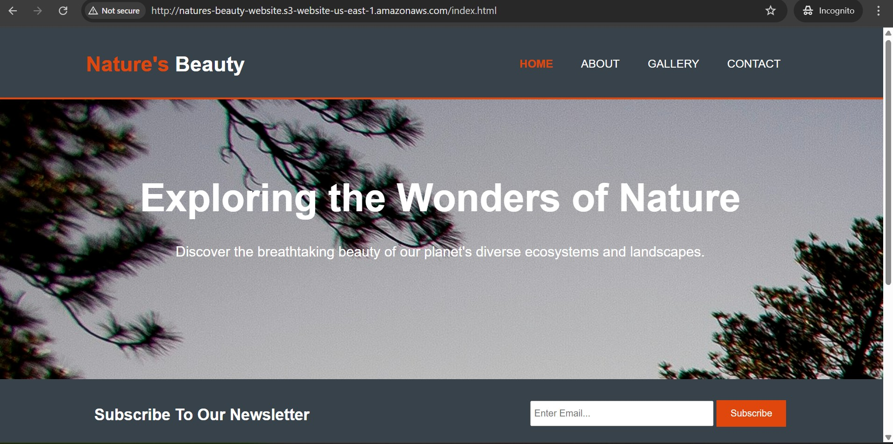

# 🚀 AWS S3 Static Website Hosting

This project demonstrates how to host a static website on Amazon S3. It's a beginner-friendly project for learning AWS services, including S3, IAM, and basic web hosting.

## 📝 Project Description

The static website is a simple HTML/CSS landing page stored in an S3 bucket. AWS S3 provides a cost-effective and scalable solution for hosting static websites, and this project walks through setting it up step-by-step.

---

## 🛠️ Technologies Used

- AWS S3
- AWS IAM (for permissions)
- HTML & CSS
- Git (for version control)

---

## 📂 Project Structure

```
aws-s3-static-website/
│
├── index.html
├── about.html
├── gallery.html
├── contact.html
├── css/
│   └── styles.css
├── js/
│   └── script.js
├── images/
│   ├── banner.jpg
│   ├── forest.jpeg
│   ├── mountain.jpeg
│   ├── ocean.jpeg
│   └── wildlife.jpeg
└── README.md


---

## ✅ Prerequisites

- AWS account
- AWS CLI (optional, but helpful)
- Basic knowledge of HTML/CSS

---

## 🚧 Steps to Set Up the Static Website

### 1. Create an S3 Bucket
- Go to the AWS Management Console.
- Navigate to **S3**.
- Click **Create Bucket**.
- Set a globally unique bucket name (e.g., `natures-beauty-website`).
- **Uncheck** "Block all public access" (to allow public web access).
- Leave other settings as default and create the bucket.

### 2. Upload Website Files
- Upload `index.html` and `styles.css` to the bucket using the Console or AWS CLI.

```sh
copy files to s3
aws s3 cp index.html s3://natures-beauty-website/
aws s3 cp about.html s3://natures-beauty-website/
aws s3 cp contact.html s3://natures-beauty-website/
aws s3 cp gallery.html s3://natures-beauty-website/
aws s3 cp script.js s3://natures-beauty-website/js/
aws s3 cp style.css s3://natures-beauty-website/css/


Copy Image folder:

aws s3 cp ./images s3://natures-beauty-website/images --recursive
```
Attributes:  All photos where downloaded free from unsplash.com.

### 3. Configure Bucket for Static Website Hosting
- Open your bucket.
- Go to **Properties** > **Static Website Hosting**.
- Choose “Enable”.
- Enter `index.html` as the index document.
- Save changes.

### 4. Set Bucket Policy to Make Content Public
Go to the **Permissions** tab and click **Bucket Policy**. Paste the following JSON:

```json
{
  "Version": "2012-10-17",
  "Statement": [
    {
      "Sid": "PublicReadGetObject",
      "Effect": "Allow",
      "Principal": "*",
      "Action": "s3:GetObject",
      "Resource": "arn:aws:s3:::natures-beauty-website/*"
    }
  ]
}
```


### 5. Access Your Website
- Go to **Properties** > **Static Website Hosting**.
- Copy the **Endpoint URL** provided at the bottom.
- Open it in your browser — your static website is live!

---

## 🔐 Optional: Set Up IAM User for S3 Access
If you'd like to upload files via CLI with limited permissions, create a dedicated IAM user:
- Go to **IAM > Users**.
- Create a new user with `AmazonS3FullAccess` or custom policy for your bucket.
- Configure credentials with the AWS CLI.

---

## 🎯 Outcome

By completing this project, you've:
- Learned how to use S3 for static web hosting.
- Understood public access and permission configuration.
- Practiced using AWS services and the AWS Console.

---

## 📸 Screenshot


---

## 📚 Resources

- [AWS Docs: Hosting a Static Website on Amazon S3](https://docs.aws.amazon.com/AmazonS3/latest/userguide/WebsiteHosting.html)
- [AWS Free Tier](https://aws.amazon.com/free/)
- [`Free pictures from unssplash`] (https://unsplash.com/)
```

🙏 Thank You! 